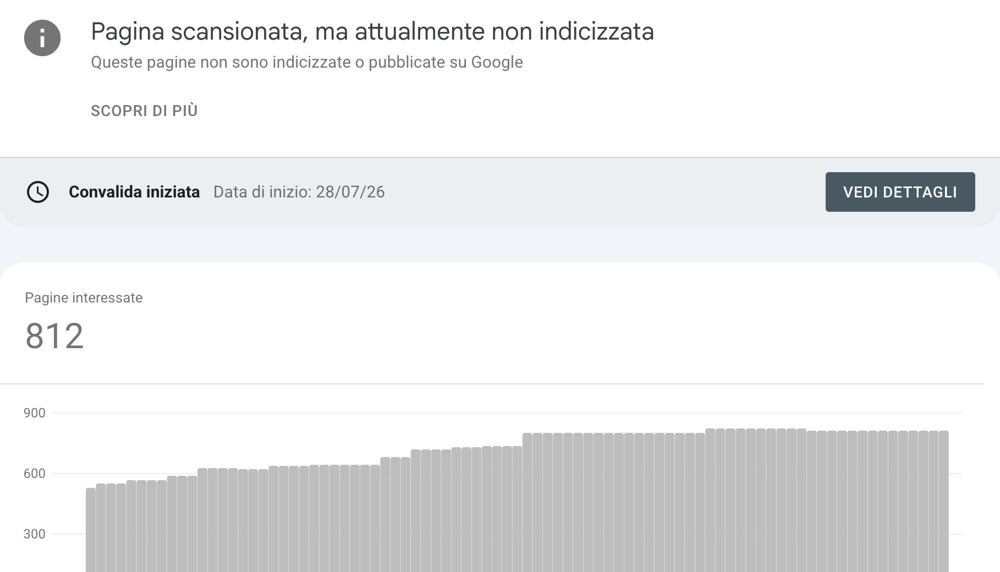

# And... it's 410 Gone! - WordPress Plugin


WordPress è fantastico e lo sappiamo.
Ma su alcuni server le richieste di generare un errore 410, che indica una condizione simile all'errore 404
ma in forma volontaria - come a dire: "ho voluto rimuovere questa pagina, Google!" - vengono ignorate o sovrascritte
dalla catena di richieste Apache / NGINX (peggio ancora se in uso entrambi). Sugli hosting economici non è possibile
cambiare questo comportamento per cui l'unica possibilità rimane quella di usare PHP. 

Questo è un plugin WordPress minimale che restituisce automaticamente **HTTP 410 Gone** per tutti e soli gli URL presenti in un file CSV esportato da **Google Search Console**.

L'obiettivo è semplice: eliminare rapidamente dall'indice di Google URL che non devono più esistere, senza dover creare centinaia di redirect o modificare manualmente `.htaccess`.

---

# Perché nasce questo plugin

Molti siti accumulano nel tempo pagine eliminate che Google continua a scansionare.

Una situazione molto comune è trovare in Search Console centinaia di URL nella sezione:

> **Pagina scansionata, ma attualmente non indicizzata**

oppure URL che sono stati rimossi definitivamente dal sito e che non devono più tornare disponibili.

In questi casi il codice HTTP **410 Gone** comunica ai motori di ricerca che la risorsa è stata rimossa in modo permanente.

---

# Come funziona

Il plugin legge un semplice file `Table.csv`, esportato dalla Search Console del tuo sito. 
Questo è un plugin di SEO tecnica ed andrebbe usato con cognizione di causa!



Ogni richiesta viene confrontata con gli URL presenti nel file.

Se l'URL è presente:

* restituisce **HTTP 410 Gone**
* mostra una semplice pagina informativa
* registra la richiesta in un file di log

Se l'URL non è presente, WordPress continua a funzionare normalmente.

Non modifica il database.

Non crea redirect.

Non altera i permalink.

---

# Installazione

Copia la cartella del plugin in:

```text
wp-content/plugins/gone-410/
```

La struttura deve essere:

```text
gone-410/
│
├── gone-410.php
├── gone.csv
└── 410.php
```

Attiva quindi il plugin dalla schermata **Plugin** di WordPress.

---

# Come ottenere il CSV

Apri **Google Search Console**.

Vai nella sezione:

**Indicizzazione → Pagine**

Seleziona il motivo:

> **Pagina scansionata, ma attualmente non indicizzata**

Premi semplicemente:

**Esporta**

Il file scaricato da Search Console può essere copiato direttamente nella cartella del plugin con il nome:

```text
gone.csv
```

Non è necessario modificarlo.

Il plugin legge automaticamente la prima colonna contenente gli URL.

---

# Aggiornare gli URL

Quando vuoi aggiungere o rimuovere URL:

1. esporta nuovamente il CSV da Search Console;
2. sostituisci `gone.csv`;
3. fatto.

Non serve modificare il plugin.

---

# Log

Ogni richiesta che restituisce un 410 viene registrata nel file:

```text
gone-410.log
```

Il log contiene:

* data e ora
* indirizzo IP
* User-Agent
* URL richiesto

Per evitare che cresca all'infinito viene eliminato automaticamente dopo 24 ore.

---

# Requisiti

* WordPress
* PHP 8.x (compatibile anche con versioni precedenti che supportano le funzioni utilizzate)
* Nessuna configurazione aggiuntiva

---

# Perché usare questo plugin

* utilizza direttamente il CSV di Search Console;
* nessuna configurazione;
* nessun database;
* nessun redirect;
* nessuna modifica ai permalink;
* installazione in pochi minuti.

È pensato per chi vuole gestire rapidamente grandi quantità di URL rimossi mantenendo il sito il più semplice possibile.

---

# Licenza

MIT
